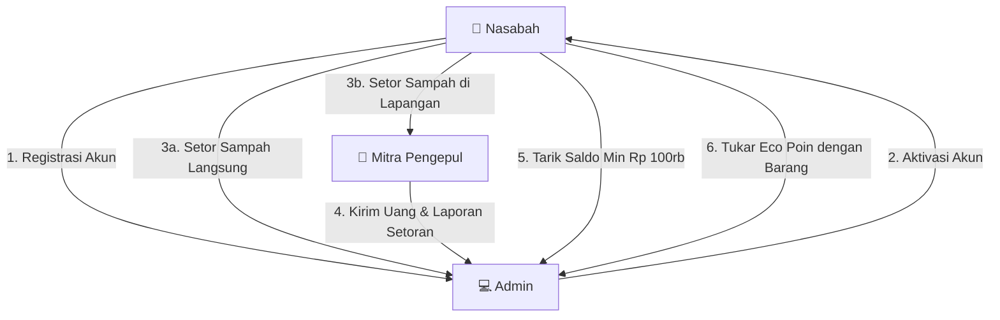

# Laporan Workflow Sistem, Logika Role, & Perubahan Skema Database

Dokumen ini disusun untuk membantu Anda memperbarui laporan proyek Bank Sampah Digital. Dokumen ini merangkum workflow bisnis dari masing-masing role secara detail beserta seluruh evolusi dan struktur tabel database saat ini.

---

## I. Workflow & Logika Bisnis Berdasarkan Role

Sistem Bank Sampah memiliki 3 role utama yang saling terintegrasi dalam ekosistem keuangan dan pengelolaan sampah:

### 1. 👤 Role: Nasabah (Pejuang Ekologis)
Nasabah adalah penyedia sampah yang akan dikonversi menjadi keuntungan finansial (saldo rupiah) dan poin gamifikasi (Eco Poin).

* **Workflow Pendaftaran & Autentikasi**:
  Nasabah mendaftar secara mandiri -> Status akun awal: `pending` -> Menunggu verifikasi Admin -> Setelah Admin menyetujui, status berubah menjadi `aktif` dan nasabah bisa masuk (login).
* **Transaksi Menabung (Setor Sampah)**:
  Nasabah memiliki dua cara untuk menyetorkan sampah:
  1. **Direct (Langsung ke Cabang Utama)**: Sampah ditimbang oleh Admin. Saldo langsung masuk 100% ke rekening tabungan nasabah.
  2. **Via Mitra Pengepul**: Pengepul mendatangi/menerima sampah nasabah di lapangan. Nasabah mendapatkan saldo instan sesuai harga beli sampah, dan otomatis mendapatkan Eco Poin (1 kg = 10 Poin).
* **Sistem Gamifikasi & Eco Poin**:
  * Poin dikalkulasi otomatis dari berat sampah (setiap 1 kg sampah disetor mendapat 10 poin).
  * Sistem memiliki tingkatan level (`Pemula` -> `Aktif` -> `Bintang`) dan lencana digital (`Eco Starter`, `Penyetor Konsisten`, `Penyelamat Bumi`).
  * Poin terbagi dua di database: `total_poin` (untuk akumulasi level selamanya) dan `poin_diperoleh` (yang dapat dibelanjakan).
* **Penarikan Saldo Uang (Pencairan)**:
  * Minimal penarikan adalah **Rp 100.000**.
  * Nasabah menginput nominal, memilih tujuan transfer secara dinamis (Pilihan Bank: BCA, Mandiri, BRI, BNI, BSI, atau E-Wallet: GoPay, OVO, Dana, LinkAja, ShopeePay), memasukkan nomor rekening/HP, dan nama pemilik.
  * Status penarikan berstatus `menunggu` hingga disetujui Admin.
* **Penukaran Eco Poin (Eco Rewards)**:
  * Nasabah dapat menukarkan `poin_diperoleh` miliknya dengan barang fisik (sembako/merchandise) yang tersedia di katalog.
  * Validasi sistem: Poin harus cukup dan stok barang di katalog masih tersedia.
  * Begitu diklik tukar, poin nasabah langsung terpotong, stok barang langsung berkurang, dan status transaksi menjadi `menunggu` untuk diambil fisiknya ke kantor.

---

### 2. 🛵 Role: Mitra Pengepul
Pengepul bertindak sebagai perpanjangan tangan bank sampah di lapangan untuk menjangkau nasabah secara langsung.

* **Pendaftaran Akun**: Akun pengepul hanya dapat dibuat oleh Admin. Pengepul harus mengaktifkan koordinat GPS lokasi mereka agar nasabah dapat menemukannya di peta interaktif.
* **Transaksi Setoran Nasabah & Perhitungan Finansial (Bagi Hasil 50/50)**:
  * Pengepul menginput ID Nasabah, jenis sampah, dan berat sampah yang ditimbang.
  * Sistem mendeteksi **Harga Beli** (yang dibayarkan ke Nasabah) dan **Harga Pasar** (nilai jual sampah ke pabrik/industri).
  * Selisih Keuntungan didapat dari: `(Harga Pasar - Harga Beli) * Berat`.
  * **Skema Bagi Hasil 50/50**: Keuntungan selisih dibagi rata secara otomatis oleh sistem:
    * **50% Komisi Pengepul** (hak milik pengepul).
    * **50% Bagian Admin** (disetorkan ke Bank Sampah).
* **Penyetoran Kolektif ke Admin**:
  * Transaksi di lapangan dikumpulkan oleh pengepul. Pengepul kemudian membuat satu **Batch Setoran** ke Admin yang berisi daftar transaksi-transaksi tersebut.
  * Pengepul mentransfer uang setoran (Total uang nasabah yang ditalangi + Bagian keuntungan Admin) ke Admin, lalu status setoran menjadi `menunggu`.

---

### 3. 💻 Role: Admin
Admin bertindak sebagai pengelola keuangan, pengambil keputusan persetujuan, dan pengelola master data sistem.

* **Persetujuan & Verifikasi Keanggotaan**: Verifikasi pendaftaran nasabah baru.
* **Master Data Management**: Melakukan CRUD untuk jenis & harga sampah, CRUD data cabang (geolokasi), serta CRUD akun Mitra Pengepul.
* **Verifikasi Setoran Pengepul**: Admin memeriksa uang transfer dari pengepul. Jika sesuai, admin mengklik **Verifikasi**. Status setoran berubah menjadi `terverifikasi` dan keuntungan admin tercatat. Jika ditolak, status transaksi pengepul dikembalikan ke belum disetor.
* **Verifikasi Pencairan Uang Nasabah**:
  * Admin meninjau permohonan pencairan saldo nasabah.
  * Admin dapat melihat detail bank/e-wallet nasabah dan menyalin nomor rekening secara otomatis (*click-to-copy*).
  * Setelah admin mentransfer uang secara manual di dunia nyata, admin menekan tombol **Setujui** di web. Sistem kemudian memotong saldo tabungan nasabah secara permanen.
* **Kelola Penukaran & Hadiah (Eco Rewards)**:
  * **CRUD Katalog Hadiah**: Menambahkan barang baru, memperbarui stok, biaya poin, atau menghapusnya dari katalog.
  * **Approve Penukaran**: Mengubah status menjadi `diambil` saat nasabah mengambil barang fisiknya ke kantor.
  * **Reject Penukaran (Auto-Refund)**: Jika ditolak, sistem otomatis mengembalikan Eco Poin ke nasabah dan mengembalikan stok barang ke katalog.
* **Laporan Finansial**: Mencetak laporan transaksi bulanan (setoran langsung dan penarikan yang disetujui).

---

## II. Perubahan Skema Database

Berikut adalah daftar tabel database dan kolom-kolom yang mengalami perubahan atau penambahan fitur baru baru-baru ini:

### 1. Tabel: `transaksi_tarik` (Pencairan Saldo Nasabah)
Tabel ini diubah dengan menambahkan kolom rekening bank riil secara dinamis demi mendukung pencairan dana non-tunai.

| Nama Kolom | Tipe Data | Keterangan |
|------------|-----------|------------|
| `id_tarik` | INT (Primary Key, Auto Increment) | ID unik transaksi penarikan |
| `tarik_tanggal` | DATE | Tanggal pengajuan |
| `tarik_jumlah` | DECIMAL(15,2) | Nominal saldo yang dicairkan |
| **`tarik_bank_tujuan`** | VARCHAR(50) (Bisa NULL) | **[BARU]** Nama Bank (e.g. BCA) atau E-Wallet (e.g. Dana) |
| **`tarik_nomor_rekening`**| VARCHAR(50) (Bisa NULL) | **[BARU]** Nomor rekening bank atau nomor HP akun E-Wallet |
| **`tarik_atas_nama`** | VARCHAR(100) (Bisa NULL)| **[BARU]** Nama pemilik rekening tujuan transfer |
| `tarik_sisa_saldo` | DECIMAL(15,2) | Saldo tabungan setelah dipotong |
| `status` | ENUM('menunggu', 'disetujui', 'ditolak') | Status persetujuan penarikan |
| `catatan` | TEXT (Bisa NULL) | Alasan penolakan / catatan admin |
| `id_nasabah` | INT (Foreign Key -> `nasabah`) | Referensi nasabah yang menarik saldo |
| `id_admin` | INT (Foreign Key -> `admin`, Bisa NULL) | Referensi admin verifikator |

---

### 2. Tabel: `hadiah` (Tabel Baru)
Tabel ini menyimpan katalog merchandise atau sembako yang dapat ditukarkan nasabah dengan Eco Poin mereka.

| Nama Kolom | Tipe Data | Keterangan |
|------------|-----------|------------|
| `id_hadiah` | INT (Primary Key, Auto Increment) | ID unik barang hadiah |
| `nama_hadiah` | VARCHAR(100) (Unique) | Nama barang (e.g. "Minyak Goreng 1L") |
| `poin_butuh` | INT | Jumlah Eco Poin yang dibutuhkan untuk 1 pcs barang |
| `stok` | INT | Jumlah stok fisik barang yang tersedia |
| `keterangan` | TEXT (Bisa NULL) | Deskripsi/detail barang hadiah |
| `created_at` | TIMESTAMP | Waktu pembuatan data |
| `updated_at` | TIMESTAMP | Waktu pembaruan data |

---

### 3. Tabel: `penukaran_reward` (Tabel Baru)
Tabel transaksi ini mencatat pengajuan dan riwayat penukaran Eco Poin nasabah dengan barang katalog hadiah.

| Nama Kolom | Tipe Data | Keterangan |
|------------|-----------|------------|
| `id_penukaran` | INT (Primary Key, Auto Increment) | ID unik transaksi penukaran |
| `id_nasabah` | INT (Foreign Key -> `nasabah`) | Referensi nasabah yang menukar poin |
| `id_hadiah` | INT (Foreign Key -> `hadiah`) | Referensi barang hadiah yang ditukar |
| `jumlah` | INT | Kuantitas pcs barang yang ditukar |
| `total_poin_ditukar` | INT | Total Eco Poin yang digunakan (`poin_butuh * jumlah`) |
| `status` | ENUM('menunggu', 'diambil', 'ditolak') | Status pengambilan barang oleh nasabah |
| `catatan` | TEXT (Bisa NULL) | Alasan penolakan dari admin |
| `tanggal_tukar` | DATE | Tanggal pengajuan penukaran |
| `id_admin` | INT (Foreign Key -> `admin`, Bisa NULL) | Referensi admin verifikator/penyerah barang |
| `created_at` | TIMESTAMP | Waktu transaksi diajukan |
| `updated_at` | TIMESTAMP | Waktu transaksi diperbarui |

---

### 4. Tabel: `transaksi_pengepul`
Tabel ini digunakan oleh Mitra Pengepul untuk mencatat setoran sampah nasabah di lapangan dengan tambahan formula bagi hasil finansial.

| Nama Kolom | Tipe Data | Keterangan |
|------------|-----------|------------|
| `id` | INT (Primary Key, Auto Increment) | ID unik transaksi pengepul |
| `pengepul_id` | INT (Foreign Key -> `pengepul`) | ID Pengepul yang bertransaksi |
| `nasabah_id` | INT (Foreign Key -> `nasabah`) | ID Nasabah penyetor sampah |
| `id_sampah` | INT (Foreign Key -> `sampah`) | Jenis sampah yang disetorkan |
| `berat_kg` | DECIMAL(8,2) | Berat sampah dalam satuan kilogram |
| **`harga_beli_kg`** | DECIMAL(15,2) | Harga beli per kg yang dibayarkan ke Nasabah |
| **`harga_pasar_kg`**| DECIMAL(15,2) | Harga jual pasar per kg ke pabrik industri |
| **`nilai_idr`** | DECIMAL(15,2) | Nilai uang yang didapatkan nasabah (`harga_beli_kg * berat`) |
| **`selisih_total`** | DECIMAL(15,2) | Total keuntungan kotor (`(harga_pasar_kg - harga_beli_kg) * berat`) |
| **`komisi_pengepul`**| DECIMAL(15,2) | 50% bagian keuntungan bersih milik Pengepul |
| **`bagian_admin`** | DECIMAL(15,2) | 50% bagian keuntungan bersih milik Admin |
| **`sudah_disetor`** | TINYINT(1) / BOOLEAN | Menandakan apakah transaksi sudah dimasukkan ke batch setoran ke admin |
| `tanggal` | DATE | Tanggal transaksi dilakukan |
| `keterangan` | TEXT (Bisa NULL) | Catatan opsional transaksi |

---

### 5. Tabel: `setoran_pengepul` (Tabel Baru)
Tabel ini menyimpan riwayat pengajuan penyetoran dana dan sampah secara kolektif (*batch*) dari Mitra Pengepul kepada Admin.

| Nama Kolom | Tipe Data | Keterangan |
|------------|-----------|------------|
| `id` | INT (Primary Key, Auto Increment) | ID unik batch setoran |
| `pengepul_id` | INT (Foreign Key -> `pengepul`) | ID Pengepul pengaju setoran |
| `total_nilai_nasabah`| DECIMAL(15,2) | Total uang nasabah yang harus disetor balik ke pengepul (dana talangan) |
| `total_selisih` | DECIMAL(15,2) | Total selisih harga pasar dan harga beli |
| `total_komisi_pengepul`| DECIMAL(15,2) | Total komisi pengepul dari seluruh transaksi dalam batch |
| `total_bagian_admin` | DECIMAL(15,2) | Total hak bersih admin dari seluruh transaksi dalam batch |
| `total_disetor` | DECIMAL(15,2) | Total dana yang ditransfer pengepul (`total_nilai_nasabah + total_bagian_admin`) |
| `transaksi_ids` | JSON | Kumpulan ID transaksi dari tabel `transaksi_pengepul` |
| `status` | ENUM('menunggu', 'terverifikasi', 'ditolak') | Status persetujuan admin |
| `catatan` | TEXT (Bisa NULL) | Catatan verifikasi atau alasan penolakan dari admin |
| `id_admin` | INT (Foreign Key -> `admin`, Bisa NULL) | ID Admin yang memverifikasi setoran ini |
| `created_at` | TIMESTAMP | Waktu pengajuan setoran |
| `updated_at` | TIMESTAMP | Waktu pembaruan status setoran |
