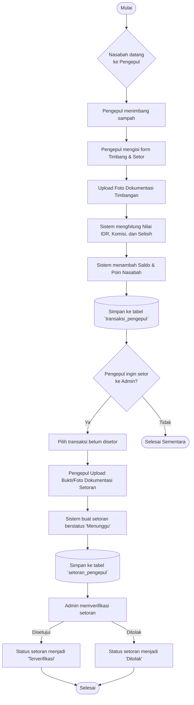

# Skema Database & Alur Sistem Bank Sampah

Dokumen ini berisi pembaruan struktur relasi database (ERD) dan flowchart untuk proses operasional Bank Sampah yang mencakup fitur baru yaitu lampiran foto dokumentasi verifikasi pada transaksi Pengepul.

## 1. Flowchart Alur Transaksi Pengepul

Flowchart di bawah ini menjelaskan proses dari nasabah menyetorkan sampah ke pengepul, lalu pengepul menyetorkannya kembali ke admin, dengan adanya bukti unggah `foto_dokumentasi`.

## 2. Entity Relationship Diagram (ERD)

Berikut merupakan gambaran struktur lengkap relasi database saat ini. Perhatikan adanya penambahan field `foto_dokumentasi` pada entitas terkait.

```mermaid
erDiagram
    ADMIN ||--o{ TRANSAKSI_SETOR : memproses
    ADMIN ||--o{ TRANSAKSI_TARIK : menyetujui
    ADMIN ||--o{ GEOLOKASI : mengelola
    ADMIN ||--o{ SETORAN_PENGEPUL : memverifikasi
    
    NASABAH ||--o{ TRANSAKSI_SETOR : melakukan
    NASABAH ||--o{ TRANSAKSI_TARIK : melakukan
    NASABAH ||--o| TABUNGAN : memiliki
    NASABAH ||--o| GAMIFIKASI : memiliki
    NASABAH ||--o{ TRANSAKSI_PENGEPUL : menyetor_ke_pengepul
    NASABAH ||--o{ PENUKARAN_REWARD : melakukan
    
    PENGEPUL ||--o{ TRANSAKSI_PENGEPUL : memproses
    PENGEPUL ||--o{ SETORAN_PENGEPUL : membuat
    
    SAMPAH ||--o{ TRANSAKSI_SETOR : dicatat_sebagai
    SAMPAH ||--o{ TRANSAKSI_PENGEPUL : dicatat_sebagai
    
    HADIAH ||--o{ PENUKARAN_REWARD : ditebus_menjadi
    
    ADMIN {
        int id_admin PK
        string admin_nama
        string admin_username
        string admin_password
    }

    NASABAH {
        int id_nasabah PK
        string nasabah_nama
        string nasabah_nik
        string nasabah_saldo
        string nasabah_status
    }
    
    PENGEPUL {
        int id PK
        string nama
        string username
        string password
        decimal komisi_persen
        boolean status_aktif
        decimal latitude
        decimal longitude
    }

    SAMPAH {
        int id_sampah PK
        string sampah_name
        string sampah_jenis
        decimal sampah_harga_kg
        decimal sampah_harga_pasar
    }

    TRANSAKSI_SETOR {
        int id_setor PK
        int id_nasabah FK
        int id_admin FK
        int id_sampah FK
        decimal setor_berat_kg
        decimal setor_harga_total
        string foto_dokumentasi "NEW FIELD"
    }

    TRANSAKSI_PENGEPUL {
        int id PK
        int pengepul_id FK
        int nasabah_id FK
        int id_sampah FK
        decimal berat_kg
        decimal harga_beli_kg
        decimal nilai_idr
        decimal komisi_pengepul
        decimal bagian_admin
        boolean sudah_disetor
        string foto_dokumentasi "NEW FIELD"
    }
    
    SETORAN_PENGEPUL {
        int id PK
        int pengepul_id FK
        int id_admin FK
        decimal total_nilai_nasabah
        decimal total_komisi_pengepul
        decimal total_bagian_admin
        decimal total_disetor
        json transaksi_ids
        string status
        string foto_dokumentasi "NEW FIELD"
    }

    TRANSAKSI_TARIK {
        int id_tarik PK
        int id_nasabah FK
        int id_admin FK
        decimal tarik_jumlah
        string tarik_status
        string tarik_bank_tujuan
    }

    TABUNGAN {
        int id_tabungan PK
        int id_nasabah FK
        string tabungan_no_rekening
        decimal tabungan_saldo_akhir
    }

    GAMIFIKASI {
        int id_gamifikasi PK
        int id_nasabah FK
        int total_poin
        string level_nasabah
        string badge
    }
    
    HADIAH {
        int id PK
        string nama_hadiah
        int poin_dibutuhkan
        int stok
    }
    
    PENUKARAN_REWARD {
        int id PK
        int nasabah_id FK
        int hadiah_id FK
        int admin_id FK
        int poin_digunakan
        string status
    }
    
    GEOLOKASI {
        int id_lokasi PK
        int id_admin FK
        string nama_lokasi
        decimal latitude
        decimal longitude
    }
```

## Ringkasan Perubahan
1. **Entitas `TRANSAKSI_SETOR`**: Ditambahkan atribut `foto_dokumentasi` sebagai path penyimpan gambar saat nasabah menyetor langsung ke admin.
2. **Entitas `TRANSAKSI_PENGEPUL`**: Ditambahkan atribut `foto_dokumentasi` sebagai foto timbangan dari transaksi nasabah dengan pengepul.
3. **Entitas `SETORAN_PENGEPUL`**: Ditambahkan atribut `foto_dokumentasi` untuk mengunggah bukti/resi setoran uang atau dokumentasi setor dari pengepul ke admin pusat.
